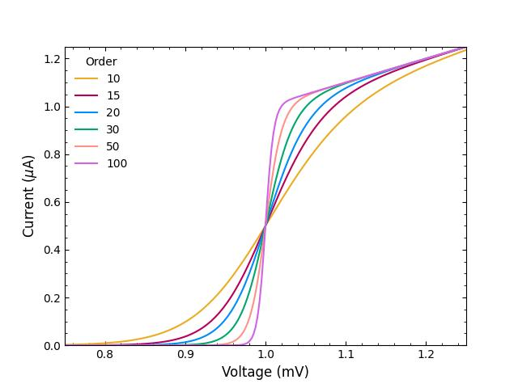

# Simple Scientific Style for Matplotlib

A simple stylesheet for matplotlib because I'm unhappy with the default ones.
There are some much more elaborate style sheets out there (see section below), but sometimes they often require to pip install a package and might be an overkill for a quick plot.

You can use this stylesheet as easy as this:

```matplotlib
import matplotlib.pyplot as plt

plt.style.use('https://github.com/klieret/simple-science-style/raw/main/stylesheets/sss1.mplstyle')
```

And this is what it looks like:



## Other examples

Here's some other stylesheets that I like:

- https://github.com/garrettj403/SciencePlots
- https://github.com/dhaitz/matplotlib-stylesheets
- https://github.com/nschloe/matplotx
